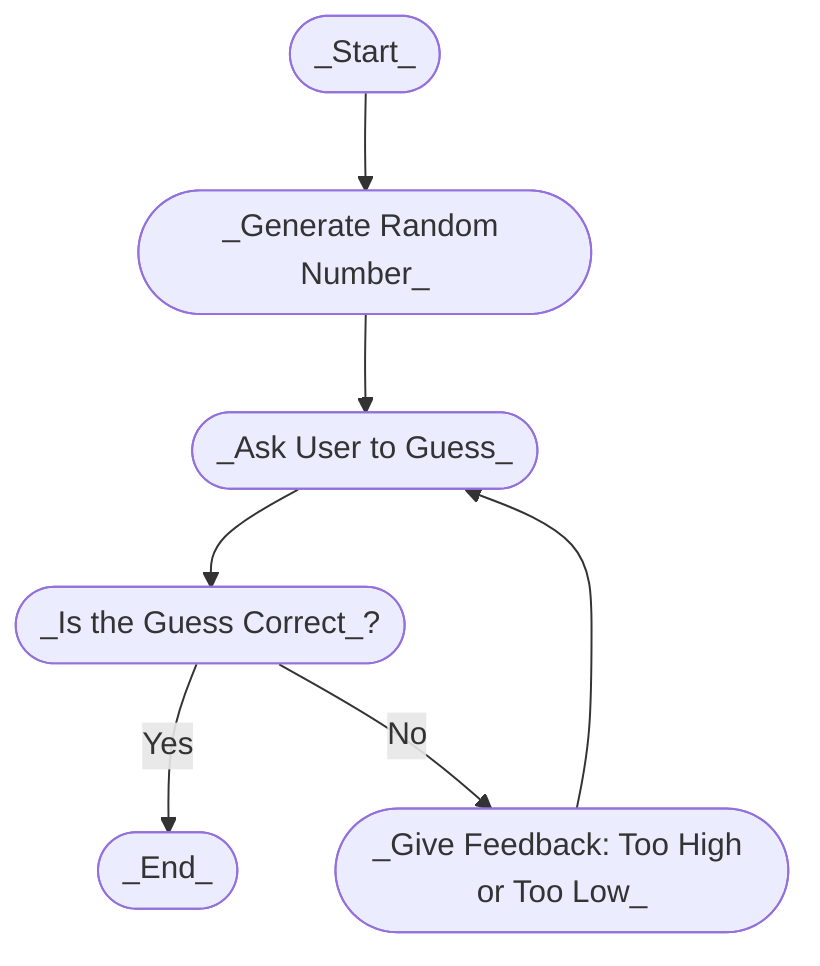

# My Guessing Game

This file explains the flow of the guessing game.

## Flowchart

Below is a the flowchart showing how the game works:

##### _In the first line we start by using the Mermaid syntax. First we generate a randon number, then we use the same id to make a new id which ask's the user to guess the number. Then we use the same id to make another id which tells if if it is correct? Then we put two conditions using the same Id. In the first if the guessed number is correct the program ends, if the guessed number is too high or too low it will take back to the same id where is asks the user to input the guess._ 
